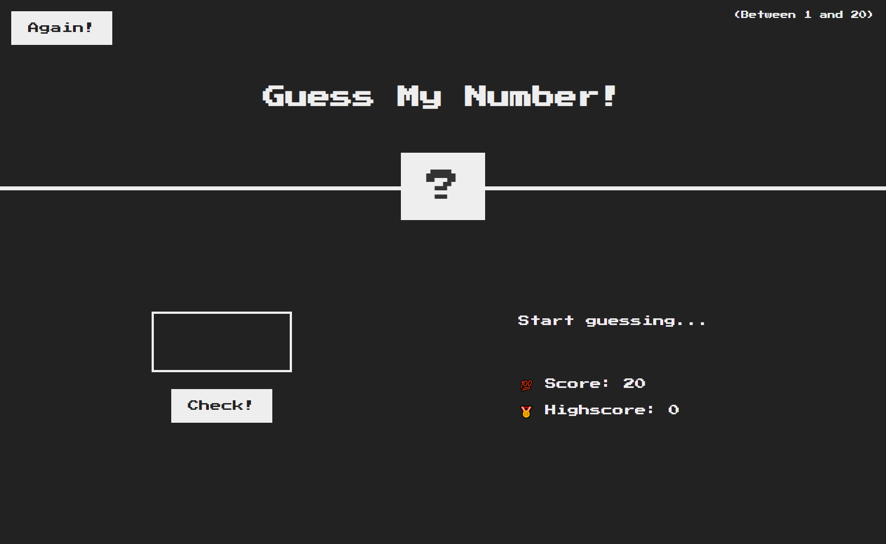

## Welcome! 👋

Thanks for checking out this mini project
This is a simple web application showcasing my command of HTML, CSS and Javascript. The game itself is pretty simple as well. The user inputs a number to guess the secret number

## The challenge

The main challenge here creating a solid game logic and implementing it through Javascript

## Features

- Error handling
- Score tracking
- High Score retention
- Reset button

## Technologies used

- HTML - Used to create the index.html file
- CSS - Used to design the webpage
- Javascript - Used for app's logic implementation
- VSCode - IDE I used to create the web app
- Git - For version control
- Netflify - Used to host this web app

## Preview

## Deployment

You may visit the deployed web app through the link below.

- [https://amiralles-guessmynumber.netlify.app/](https://amiralles-guessmynumber.netlify.app/)

## Footer

Thank you for taking the time in checking out this repository.

**Argel Miralles | Full Stack Web Developer** 
**SIC PARVIS MAGNA**☝
